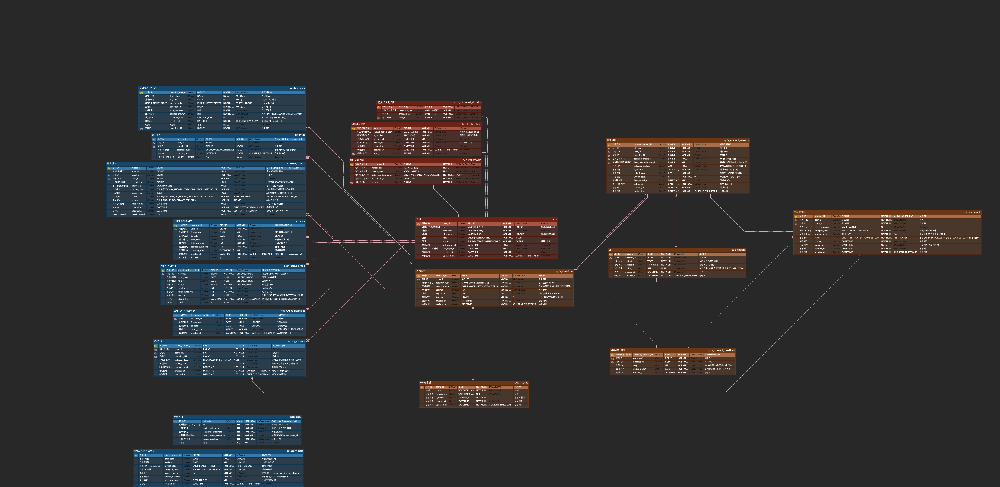

# Japanese Quiz

## 🛠 Tech Stack
- **Java**: 17
- **Spring Boot**: 3.5.10
- **Database**: MariaDB
- **ORM**: MyBatis, JPA (사용하는 것 명시)

## Erd Cloud

🔗 [ERDCloud에서 상세 구조 보기](https://www.erdcloud.com/d/TtTRJk6SyApqT24cu)

## 1. 개발 환경 (IDE)
   IntelliJ IDEA 사용을 표준으로 합니다. 불필요한 코드 포맷팅 충돌을 방지하기 위해, 커밋 전 반드시 아래 단축키를 사용하여 코드를 정리합니다.

자동 정렬 (Reformat Code)

macOS: Cmd + Opt + L

임포트 정리 (Optimize Imports)

macOS: Ctrl + Opt + O

## 2. 네이밍 규칙 (Naming Convention)
### 2.1. 언어별 표기법
Java (클래스, 메서드, 변수)

CamelCase를 사용합니다.

클래스: PascalCase (첫 글자 대문자) → 예: QuizService

메서드/변수: lowerCamelCase (첫 글자 소문자) → 예: findById

Database (테이블, 컬럼)

Snake_case를 사용합니다.

예: quiz_history, created_at

Enum / 상수

UPPER_SNAKE_CASE를 사용합니다.

예: ROLE_USER, MAX_COUNT

### 2.2. 패키지 및 클래스 구조
패키지: 소문자로만 작성하며, 도메인(기능) 단위로 구성합니다.

클래스: 명사 형태로 명확하게 작성합니다.

구현체: 인터페이스 이름 뒤에 Impl을 붙입니다. (예: QuizServiceImpl)

### 2.3. 메서드명 표준 어휘 (고정 사용)
혼선을 줄이기 위해 주요 동작에 대한 어휘를 통일합니다.

find: 단건 조회 (예: findById). 반환 타입은 Optional 사용을 권장합니다.

findList / findAll: 목록 조회 (예: findAllByName).

search: 검색 (조건). 복잡한 쿼리나 필터링 시 사용합니다.

exists: 존재 여부 (예: existsByEmail). boolean을 반환합니다.

save: 저장 및 등록 (예: saveMember).

update: 수정 (예: updatePassword). 단순 Setter가 아닌 비즈니스 로직이 포함된 경우 사용합니다.

delete: 삭제 (예: deleteById). remove 사용을 지양합니다.

## 3. 구조 및 패턴 (Structure & Patterns)
### 3.1. 계층 간 데이터 전송
Controller는 절대 Entity를 직접 반환하지 않습니다. API 스펙 변경 방지와 순환 참조 예방을 위해 반드시 DTO로 변환하여 반환합니다.

### 3.2. Entity 작성 및 Lombok 사용
@Setter 사용 금지: 객체의 무분별한 변경을 막기 위해 사용을 지양합니다.

@Builder 사용 권장: 생성자 대신 빌더 패턴을 사용합니다.

변경 로직 메서드화: setTitle() 같은 단순 세터 대신, 의도가 드러나는 메서드를 작성합니다. (예: public void updateTitle(String newTitle) { ... })

## 4. 깃 컨벤션 (Git Convention)
### 4.1. 브랜치 전략
작업 추적을 명확히 하기 위해 브랜치명에 작업자 이니셜을 포함합니다.

형식: 타입/이니셜/기능명

작성 예시:

feat/pcj/login-api (로그인 API 개발)

fix/pcj/quiz-score-error (퀴즈 점수 오류 수정)

### 4.2. 커밋 메시지 규칙
제목에 대괄호로 타입을 명시합니다.

형식: [Type] 기능 설명

작성 예시: [Feat] 회원가입 검증 로직 추가

Type 종류:

[Feat]: 새로운 기능 추가

[Fix]: 버그 수정

[Refactor]: 코드 리팩토링 (기능 변경 없음)

[Docs]: 문서 수정

[Chore]: 빌드, 설정 파일 등 코드 외적인 수정

### 4.3. 풀 리퀘스트 (PR) 규칙 
PR 제목 커밋 메시지 규칙과 동일하게 [Type] 요약 형식을 사용합니다. (예: [Feat] 퀴즈 정답 채점 기능 구현)
```
아래 내용 복사 붙혀넣기 할 것

## 작업 내용
- (무엇을 개발/수정했는지 간략히 요약)

## 상세 변경 사항
- (주요 로직 변경점이나 주의 깊게 봐야 할 코드 설명)

## 테스트 방법
- (리뷰어가 어떻게 테스트해볼 수 있는지. 예: 특정 API 호출 등)

## 관련 이슈
- (예: Closes #12)
```

### 리뷰 및 머지

PR 생성 후 반드시 **1명 이상의 리뷰어(Reviewer)**를 지정합니다.

리뷰어의 **승인(Approve)**을 받은 후, 작성자가 직접 Merge를 수행합니다.

Merge가 완료된 브랜치는 즉시 삭제하여 저장소를 정리합니다.
## 5. 공통 설정 (YML / Swagger / Actuator)
### 5.1. 아주 쉽게 설명
- `application.yml`은 **공통 설정**이에요. 모두가 같이 쓰는 기본값만 넣습니다.
- `application-local.yml`은 **내 컴퓨터 전용 설정**이에요. (비밀번호 등)
- `application-local.yml.example`는 **예시 파일**이라서 팀원이 복사해서 쓰면 됩니다.
- `application-dev.yml` / `application-prod.yml`은 **서버용 설정**이에요.

### 5.2. 프로필이 뭔가요?
- 프로필은 "어떤 설정 파일을 쓸지 고르는 스위치"입니다.
- 기본은 `local`이라서 로컬에서는 자동으로 `application-local.yml`을 봅니다.

### 5.3. Swagger / Actuator는 왜 나눠요?
- **로컬/개발**에서는 API 문서와 상태 체크가 필요해서 켜둡니다.
- **운영**에서는 보안 때문에 끕니다.

### 5.4. 팀원 로컬 설정 가이드 (초보용)
1) `src/main/resources/application-local.yml.example`을 복사합니다.
2) 새 파일 이름을 `application-local.yml`로 바꿉니다.
3) 아래 3줄을 **내 DB 정보**로 바꿉니다.
   - `spring.datasource.url`
   - `spring.datasource.username`
   - `spring.datasource.password`
4) 이 파일은 Git에 올라가지 않습니다. (비밀번호 보호)

### 5.5. 개발/운영 서버 환경변수 (필수)
- 서버에서는 아래 값을 환경변수로 넣어야 합니다.
  - `DB_URL`
  - `DB_USERNAME`
  - `DB_PASSWORD`

## 6. CORS 설정 설명 (팀원용)
### 6.1. 왜 필요한가요?
- 프론트가 다른 주소(포트 포함)에서 API를 호출하면 기본적으로 브라우저가 막습니다.
- 그래서 서버에서 "이 주소는 허용"이라고 명시해줘야 합니다.

### 6.2. 어디에 설정하나요?
- 로컬에서는 `src/main/resources/application-local.yml`에서 설정합니다.
- 예시 파일은 `src/main/resources/application-local.yml.example`에 있습니다.

### 6.3. 로컬에서 꼭 수정할 값
- `app.cors.allowed-origins`
- 예시: `http://localhost:3000,http://localhost:5173`

### 6.4. 언제 수정하면 되나요?
- 프론트 주소가 정해지면 바로 수정하면 됩니다.
- 지금 프론트 주소가 없으면 비워둬도 됩니다.
