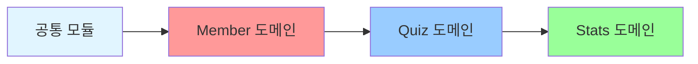
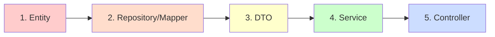
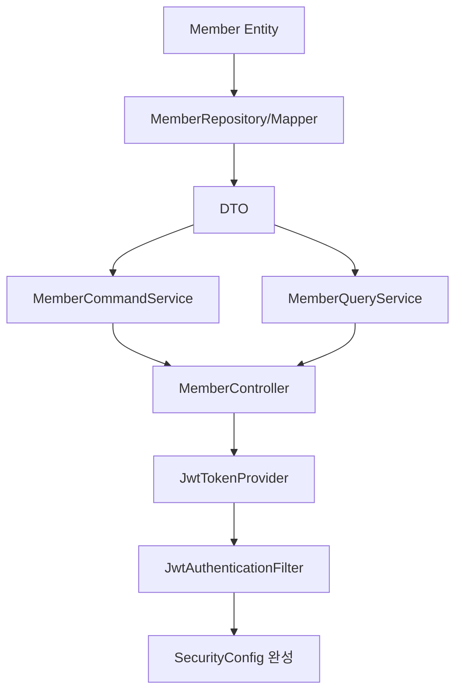
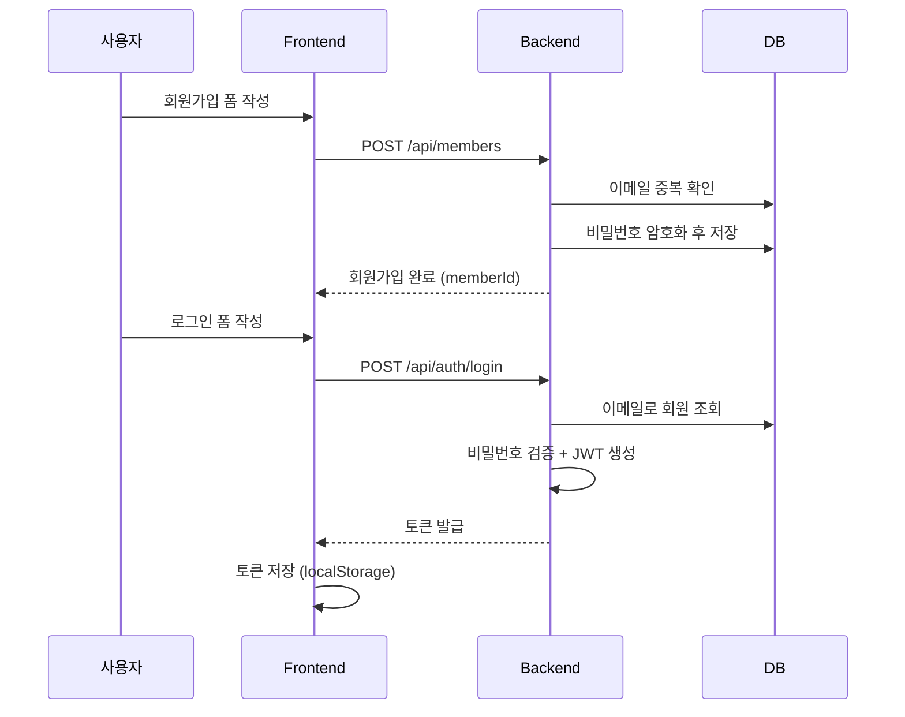
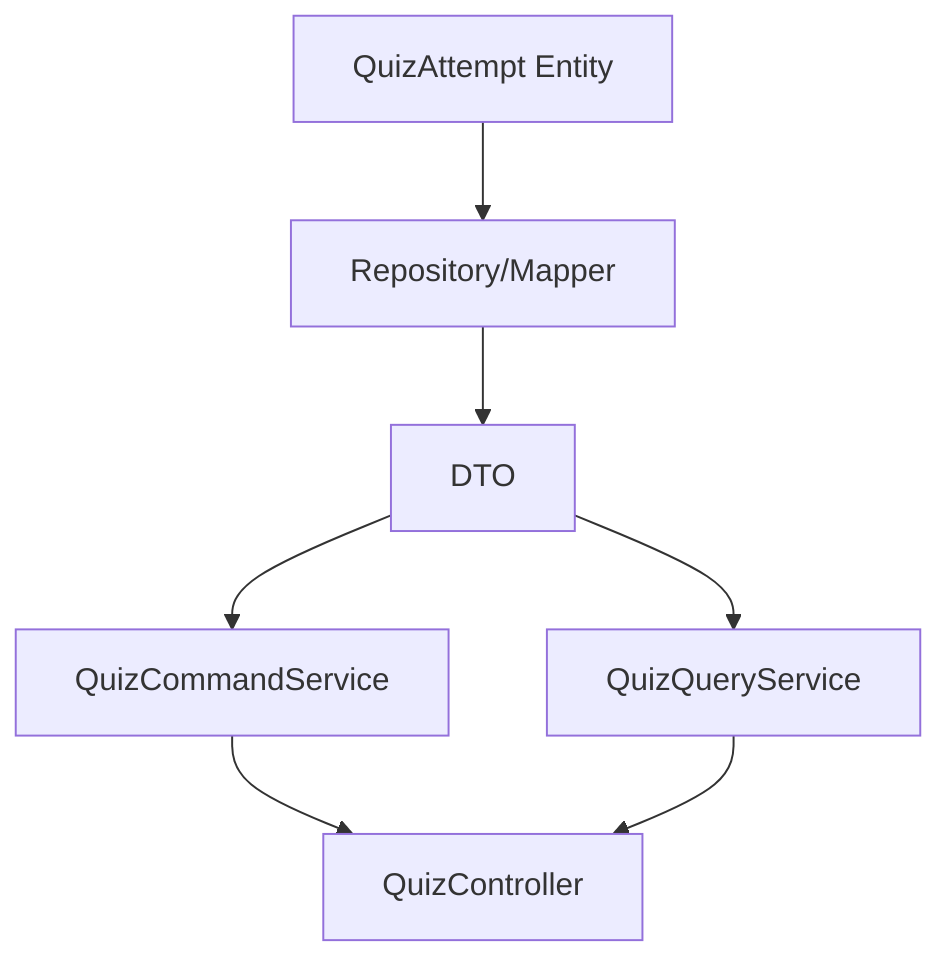
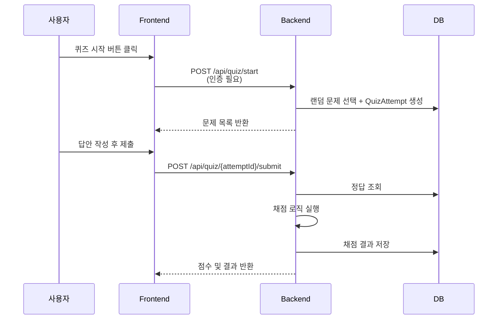
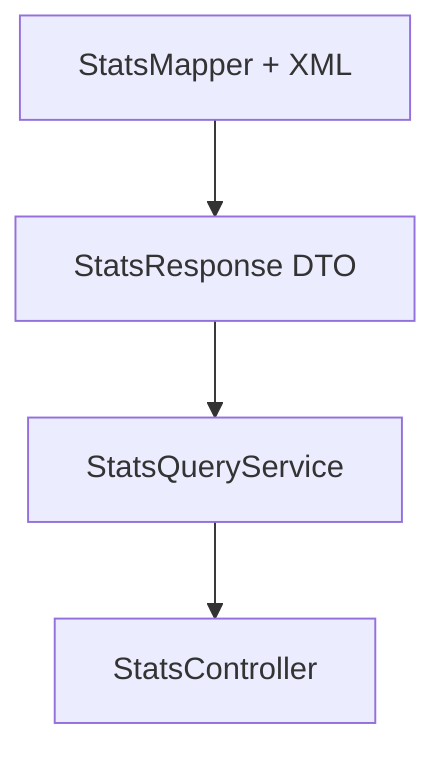
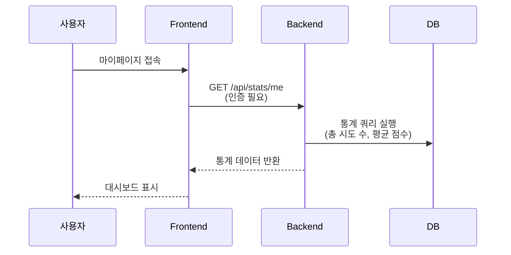

# Japanese Quiz 프로젝트 기능 개발 구현 가이드

## 📋 목차
1. [프로젝트 구조 개요](#1-프로젝트-구조-개요)
2. [전체 구현 순서 및 원칙](#2-전체-구현-순서-및-원칙)
3. [공통 모듈 (Common)](#3-공통-모듈-common)
4. [Member 도메인](#4-member-도메인)
5. [Quiz 도메인](#5-quiz-도메인)
6. [Stats 도메인](#6-stats-도메인)
7. [추가 권장 사항](#7-추가-권장-사항)

---

## 1. 프로젝트 구조 개요

### 1.1 CQRS 패턴이란?

**CQRS (Command Query Responsibility Segregation, 명령 조회 책임 분리)**

- **Command (명령)**: 데이터를 **변경**하는 작업 → Create, Update, Delete
- **Query (조회)**: 데이터를 **읽기만** 하는 작업 → Read

#### 왜 분리하나요?
1. **성능 최적화**: 쓰기(JPA)와 읽기(MyBatis) 각각 다른 방식으로 최적화
2. **책임 명확화**: 데이터 변경 로직과 조회 로직이 섞이지 않음
3. **확장성**: 나중에 읽기/쓰기 DB를 분리할 수 있음

### 1.2 디렉토리 구조

```
member/
├── command/              # 데이터 변경 (등록, 수정, 삭제)
│   ├── application/      # MemberCommandService
│   ├── domain/           # Member Entity
│   └── infrastructure/   # MemberRepository (JPA)
├── query/                # 데이터 조회
│   ├── application/      # MemberQueryService
│   └── infrastructure/   # MemberMapper (MyBatis)
├── dto/
│   ├── request/          # 요청 DTO
│   └── response/         # 응답 DTO
└── presentation/         # MemberController
```

### 1.3 기술 스택

| 계층 | 기술 | 용도 |
|------|------|------|
| **Command (쓰기)** | JPA + Spring Data JPA | Entity 기반 CRUD |
| **Query (읽기)** | MyBatis | 복잡한 조회 쿼리 최적화 |
| **인증** | JWT + Spring Security | 토큰 기반 인증/인가 |
| **API 문서** | Swagger (Springdoc OpenAPI) | API 명세 자동 생성 |

---

## 2. 전체 구현 순서 및 원칙

### 2.1 도메인 간 구현 순서 (의존성 기반)



| 순서 | 도메인 | 왜 이 순서인가? |
|------|--------|----------------|
| 0 | **공통 모듈** | 모든 Controller가 사용하는 ApiResponse, ErrorCode 등 |
| 1 | **Member** | JWT 인증 필요, Quiz/Stats가 member_id 참조 |
| 2 | **Quiz** | Stats가 Quiz 데이터를 집계 |
| 3 | **Stats** | Member와 Quiz 데이터를 조회만 함 |

### 2.2 각 도메인 내부 구현 순서 (공통)



| 순서 | 계층 | 왜 이 순서인가? |
|------|------|----------------|
| 1 | **Entity** | 데이터 구조의 뼈대, 나머지 계층이 참조 |
| 2 | **Repository / Mapper** | 데이터 접근 계층, Service가 사용 |
| 3 | **DTO** | Request/Response 객체, Service와 Controller가 사용 |
| 4 | **Service** | 비즈니스 로직, Controller가 호출 |
| 5 | **Controller** | API 엔드포인트, 모든 계층을 통합 |

### 2.3 핵심 원칙 요약

| 원칙 | 설명 |
|------|------|
| ✅ **한 도메인씩 완성 후 테스트** | 각 도메인 완성 후 Swagger로 API 테스트 |
| ✅ **Entity 직접 반환 금지** | Controller는 반드시 DTO로 변환하여 응답 |
| ✅ **Member 도메인 우선 완성** | JWT 인증이 있어야 다른 API 테스트 가능 |
| ⚠️ **계층별 주의사항 준수** | Entity: @Setter 금지, Service: @Transactional 구분 |

---

## 3. 공통 모듈 (Common)

> **중요도**: ⭐️⭐️⭐️ (최우선)  
> **왜 필요한가?**: 모든 도메인의 Controller가 공통으로 사용하는 응답 포맷과 에러 처리 표준화

### 3.1 구현 순서

1. `ApiResponse` - 모든 API 응답 표준 포맷
2. `PageResponse` - 페이징 응답 포맷
3. `ErrorCode` Enum - 에러 코드 정의
4. `CustomException` - 커스텀 예외
5. `GlobalExceptionHandler` - 전역 예외 처리

### 3.2 체크리스트

- [ ] `ApiResponse` 구현
  - [ ] `success(T data)` 정적 메서드
  - [ ] `error(String code, String message)` 정적 메서드
  - [ ] 필드: code, message, data
- [ ] `PageResponse` 구현
  - [ ] 필드: content, page, size, totalElements, totalPages
  - [ ] `of()` 정적 팩토리 메서드
- [ ] `ErrorCode` Enum 정의
  - [ ] DUPLICATE_EMAIL ("이미 사용 중인 이메일입니다.")
  - [ ] MEMBER_NOT_FOUND ("회원을 찾을 수 없습니다.")
  - [ ] INVALID_PASSWORD ("비밀번호가 일치하지 않습니다.")
  - [ ] ATTEMPT_NOT_FOUND ("퀴즈 시도를 찾을 수 없습니다.")
  - [ ] INVALID_TOKEN ("유효하지 않은 토큰입니다.")
- [ ] `CustomException` 구현
  - [ ] 생성자: `CustomException(ErrorCode errorCode)`
  - [ ] RuntimeException 상속
- [ ] `GlobalExceptionHandler` 구현
  - [ ] @RestControllerAdvice 어노테이션
  - [ ] `@ExceptionHandler(CustomException.class)` 메서드
  - [ ] `@ExceptionHandler(MethodArgumentNotValidException.class)` 메서드

### 3.3 주의사항

- ApiResponse는 **제네릭 타입**으로 구현하여 어떤 데이터 타입도 담을 수 있도록 설계
- ErrorCode는 프로젝트 진행하며 **점진적으로 추가** (처음부터 모두 정의할 필요 없음)
- GlobalExceptionHandler는 **모든 예외를 ApiResponse 포맷으로 통일**

---

## 4. Member 도메인

> **중요도**: ⭐️⭐️⭐️ (최우선)  
> **왜 필요한가?**: JWT 인증/인가 구현, 다른 도메인이 member_id를 참조

### 4.1 구현 순서



1. **Entity & Repository**
   - Member Entity 작성
   - MemberRole Enum 작성
   - MemberRepository (JPA) 인터페이스
   - MemberMapper (MyBatis) 인터페이스 + XML

2. **DTO**
   - Request: MemberRegisterRequest, MemberLoginRequest, MemberUpdateRequest
   - Response: MemberResponse, TokenResponse

3. **Service**
   - MemberCommandService (회원가입, 정보수정, 탈퇴)
   - MemberQueryService (조회)

4. **Controller**
   - MemberController (CRUD API)

5. **Security (중요!)**
   - JwtTokenProvider (토큰 생성/검증)
   - JwtAuthenticationFilter (토큰 기반 인증)
   - UserPrincipal (Spring Security UserDetails)
   - SecurityConfig 완성 (401/403 핸들러)
   - AuthController (로그인 API)

### 4.2 체크리스트

#### Entity & Repository
- [ ] `Member` Entity
  - [ ] 필드: id, email, password, nickname, role, createdAt, updatedAt
  - [ ] `@NoArgsConstructor(access = AccessLevel.PROTECTED)`
  - [ ] `@Builder` 어노테이션
  - [ ] 비즈니스 메서드: `updateNickname(String)`, `updatePassword(String)`
- [ ] `MemberRole` Enum (USER, ADMIN)
- [ ] `MemberRepository` extends JpaRepository
  - [ ] `findByEmail(String email)` → Optional<Member>
  - [ ] `existsByEmail(String email)` → boolean
- [ ] `MemberMapper` 인터페이스 (@Mapper)
  - [ ] `findById(Long id)` → MemberResponse
  - [ ] `findAllByPage(@Param offset, @Param limit)` → List<MemberResponse>
- [ ] `MemberMapper.xml`
  - [ ] ResultMap 정의 (MemberResponseMap)
  - [ ] findById 쿼리
  - [ ] findAllByPage 쿼리

#### DTO
- [ ] `MemberRegisterRequest`
  - [ ] 필드: email, password, nickname
  - [ ] Validation: @NotBlank, @Email, @Size
- [ ] `MemberLoginRequest` (email, password)
- [ ] `MemberUpdateRequest` (nickname, password)
- [ ] `MemberResponse`
  - [ ] 필드: id, email, nickname, role, createdAt
  - [ ] 정적 메서드: `from(Member member)`
- [ ] `TokenResponse` (accessToken, refreshToken, tokenType)

#### Service
- [ ] `MemberCommandService`
  - [ ] `@Service`, `@RequiredArgsConstructor`, `@Transactional`
  - [ ] 의존성: MemberRepository, PasswordEncoder
  - [ ] `registerMember(MemberRegisterRequest)` → Long
    - [ ] 이메일 중복 확인 (existsByEmail)
    - [ ] 비밀번호 암호화 (passwordEncoder.encode)
    - [ ] Member 객체 생성 및 저장
  - [ ] `updateMemberInfo(Long id, MemberUpdateRequest)` → void
  - [ ] `deleteMember(Long id)` → void
- [ ] `MemberQueryService`
  - [ ] `@Service`, `@RequiredArgsConstructor`, `@Transactional(readOnly = true)`
  - [ ] 의존성: MemberMapper
  - [ ] `findMemberById(Long id)` → MemberResponse
  - [ ] `findMemberList(int page, int size)` → PageResponse<MemberResponse>

#### Controller
- [ ] `MemberController`
  - [ ] `@RestController`, `@RequestMapping("/api/members")`, `@RequiredArgsConstructor`
  - [ ] `@Tag(name = "Member", description = "회원 관리 API")`
  - [ ] 의존성: MemberCommandService, MemberQueryService
  - [ ] `POST /api/members` - register (회원가입)
  - [ ] `GET /api/members/{id}` - getMember (회원 조회)
  - [ ] `PUT /api/members/{id}` - updateMember (정보 수정)
  - [ ] `DELETE /api/members/{id}` - deleteMember (회원 탈퇴)
  - [ ] `GET /api/members` - getMemberList (회원 목록)

#### Security (중요!)
- [ ] `JwtTokenProvider`
  - [ ] 설정: JWT secret-key, access-token 만료시간, refresh-token 만료시간
  - [ ] `generateAccessToken(Long memberId, String email)` → String
  - [ ] `generateRefreshToken(Long memberId)` → String
  - [ ] `validateToken(String token)` → boolean
  - [ ] `getUserIdFromToken(String token)` → Long
  - [ ] `getEmailFromToken(String token)` → String
- [ ] `JwtAuthenticationFilter` extends OncePerRequestFilter
  - [ ] 요청 헤더에서 "Authorization: Bearer {token}" 추출
  - [ ] 토큰 검증 (validateToken)
  - [ ] 토큰에서 사용자 정보 추출 후 SecurityContext에 저장
- [ ] `UserPrincipal` implements UserDetails
  - [ ] 필드: id, email, authorities
  - [ ] Spring Security가 사용하는 인증 정보 객체
- [ ] `SecurityConfig`
  - [ ] `jwtAuthenticationEntryPoint()` 완성 (401 응답 포맷)
  - [ ] `jwtAccessDeniedHandler()` 완성 (403 응답 포맷)
  - [ ] `passwordEncoder()` Bean 정의 (BCryptPasswordEncoder)
- [ ] `AuthController`
  - [ ] `POST /api/auth/login` - login (JWT 발급)
  - [ ] `POST /api/auth/refresh` - refreshToken (토큰 갱신)

### 4.3 메서드명 정의

#### MemberCommandService

| 메서드명 | 파라미터 | 반환 | 설명 |
|---------|----------|------|------|
| `registerMember` | MemberRegisterRequest | Long | 회원가입 |
| `updateMemberInfo` | Long id, MemberUpdateRequest | void | 회원 정보 수정 |
| `deleteMember` | Long id | void | 회원 탈퇴 |

#### MemberQueryService

| 메서드명 | 파라미터 | 반환 | 설명 |
|---------|----------|------|------|
| `findMemberById` | Long id | MemberResponse | 회원 단건 조회 |
| `findMemberList` | int page, int size | PageResponse<MemberResponse> | 회원 목록 조회 |

#### MemberController

| HTTP | 엔드포인트 | 메서드명 | 설명 |
|------|-----------|---------|------|
| POST | `/api/members` | `register` | 회원가입 |
| GET | `/api/members/{id}` | `getMember` | 회원 조회 |
| PUT | `/api/members/{id}` | `updateMember` | 회원 수정 |
| DELETE | `/api/members/{id}` | `deleteMember` | 회원 탈퇴 |
| GET | `/api/members` | `getMemberList` | 회원 목록 |

#### JwtTokenProvider

| 메서드명 | 파라미터 | 반환 | 설명 |
|---------|----------|------|------|
| `generateAccessToken` | Long memberId, String email | String | Access Token 생성 |
| `generateRefreshToken` | Long memberId | String | Refresh Token 생성 |
| `validateToken` | String token | boolean | 토큰 검증 |
| `getUserIdFromToken` | String token | Long | 토큰에서 사용자 ID 추출 |
| `getEmailFromToken` | String token | String | 토큰에서 이메일 추출 |

#### AuthController

| HTTP | 엔드포인트 | 메서드명 | 설명 |
|------|-----------|---------|------|
| POST | `/api/auth/login` | `login` | 로그인 (JWT 발급) |
| POST | `/api/auth/refresh` | `refreshToken` | 토큰 갱신 |

### 4.4 기능 플로우

#### 회원가입 및 로그인



**핵심 흐름**:
1. 회원가입 → 이메일 중복 확인 → 비밀번호 암호화 → 저장
2. 로그인 → 이메일 조회 → 비밀번호 검증 → JWT 발급
3. 이후 모든 API 요청 시 `Authorization: Bearer {token}` 헤더 필요

### 4.5 주의사항

- **PasswordEncoder Bean 등록 필수**: SecurityConfig에서 `@Bean` 등록
- **JWT secret-key는 환경변수로 관리**: application.yml에 하드코딩 금지
- **토큰 만료시간 설정**: Access Token은 짧게(30분~1시간), Refresh Token은 길게(7~14일)
- **SecurityConfig에서 /api/auth/** 경로는 permitAll()**: 로그인 시 401 무한루프 방지

---

## 5. Quiz 도메인

> **중요도**: ⭐️⭐️  
> **의존성**: Member 도메인 완성 필요 (member_id FK 참조, JWT 인증 필요)

### 5.1 구현 순서



1. **Entity & Repository**
   - QuizAttempt, QuizAttemptQuestion, QuizAttemptAnswer Entity
   - QuizAttemptRepository, QuizAttemptAnswerRepository (JPA)
   - QuizMapper (MyBatis) + XML

2. **DTO**
   - Request: StartQuizRequest, QuizSubmitRequest
   - Response: QuizAttemptResponse, QuizResultResponse

3. **Service**
   - QuizCommandService (퀴즈 시작, 답안 제출, 채점)
   - QuizQueryService (시도 이력 조회)

4. **Controller**
   - QuizController (퀴즈 API)

### 5.2 체크리스트

#### Entity & Repository
- [ ] `QuizAttempt` Entity
  - [ ] 필드: id, memberId, quizType, score, totalCount, correctCount, startedAt, completedAt
  - [ ] 비즈니스 메서드: `completeAttempt(int score, int correctCount, int totalCount)`
- [ ] `QuizAttemptQuestion` Entity
  - [ ] 필드: id, attemptId, questionId, questionOrder
- [ ] `QuizAttemptAnswer` Entity
  - [ ] 필드: id, attemptId, questionId, selectedOption, isCorrect
- [ ] `QuizAttemptRepository` extends JpaRepository
- [ ] `QuizAttemptAnswerRepository` extends JpaRepository
- [ ] `QuizMapper` 인터페이스 (@Mapper)
  - [ ] `findRandomQuestions(@Param quizType, @Param count)` → List<QuestionDto>
  - [ ] `findAnswersByAttemptId(Long attemptId)` → List<QuizAnswer>
  - [ ] `findAttemptHistory(@Param memberId, @Param offset, @Param limit)` → List
- [ ] `QuizMapper.xml`
  - [ ] findRandomQuestions 쿼리 (ORDER BY RAND() LIMIT)
  - [ ] findAnswersByAttemptId 쿼리
  - [ ] findAttemptHistory 쿼리

#### DTO
- [ ] `StartQuizRequest` (quizType, questionCount)
- [ ] `QuizSubmitRequest`
  - [ ] 필드: answers (List<SubmittedAnswer>)
  - [ ] SubmittedAnswer: questionId, selectedOption
- [ ] `QuizAttemptResponse`
  - [ ] 필드: attemptId, questions (List<QuestionDto>)
  - [ ] QuestionDto: questionId, questionText, options
- [ ] `QuizResultResponse`
  - [ ] 필드: attemptId, score, correctCount, totalCount, passStatus

#### Service
- [ ] `QuizCommandService`
  - [ ] `@Service`, `@RequiredArgsConstructor`, `@Transactional`
  - [ ] 의존성: QuizAttemptRepository, QuizAttemptAnswerRepository, QuizMapper
  - [ ] `startQuiz(Long memberId, StartQuizRequest)` → QuizAttemptResponse
    - [ ] 랜덤 문제 선택 (QuizMapper.findRandomQuestions)
    - [ ] QuizAttempt 생성 및 저장
    - [ ] QuizAttemptQuestion 생성 및 저장
    - [ ] 문제 정보 반환
  - [ ] `submitQuiz(Long attemptId, QuizSubmitRequest)` → QuizResultResponse
    - [ ] QuizAttempt 조회
    - [ ] 정답 데이터 조회 (QuizMapper.findAnswersByAttemptId)
    - [ ] 채점 로직 실행 (정답 비교)
    - [ ] QuizAttemptAnswer 저장
    - [ ] QuizAttempt 완료 처리 (completeAttempt)
    - [ ] 결과 반환
- [ ] `QuizQueryService`
  - [ ] `@Service`, `@RequiredArgsConstructor`, `@Transactional(readOnly = true)`
  - [ ] 의존성: QuizMapper
  - [ ] `findAttemptById(Long attemptId)` → QuizAttemptResponse
  - [ ] `findAttemptHistory(Long memberId, int page, int size)` → PageResponse

#### Controller
- [ ] `QuizController`
  - [ ] `@RestController`, `@RequestMapping("/api/quiz")`, `@RequiredArgsConstructor`
  - [ ] `@Tag(name = "Quiz", description = "퀴즈 관리 API")`
  - [ ] 의존성: QuizCommandService, QuizQueryService
  - [ ] `POST /api/quiz/start` - startQuiz (퀴즈 시작)
  - [ ] `POST /api/quiz/{attemptId}/submit` - submitQuiz (답안 제출)
  - [ ] `GET /api/quiz/attempts/{attemptId}` - getAttempt (시도 상세 조회)
  - [ ] `GET /api/quiz/attempts` - getAttemptHistory (시도 이력 조회)

### 5.3 메서드명 정의

#### QuizCommandService

| 메서드명 | 파라미터 | 반환 | 설명 |
|---------|----------|------|------|
| `startQuiz` | Long memberId, StartQuizRequest | QuizAttemptResponse | 퀴즈 시작 |
| `submitQuiz` | Long attemptId, QuizSubmitRequest | QuizResultResponse | 답안 제출 및 채점 |

#### QuizQueryService

| 메서드명 | 파라미터 | 반환 | 설명 |
|---------|----------|------|------|
| `findAttemptById` | Long attemptId | QuizAttemptResponse | 시도 상세 조회 |
| `findAttemptHistory` | Long memberId, int page, int size | PageResponse | 시도 이력 조회 |

#### QuizController

| HTTP | 엔드포인트 | 메서드명 | 설명 |
|------|-----------|---------|------|
| POST | `/api/quiz/start` | `startQuiz` | 퀴즈 시작 |
| POST | `/api/quiz/{attemptId}/submit` | `submitQuiz` | 답안 제출 |
| GET | `/api/quiz/attempts/{attemptId}` | `getAttempt` | 시도 상세 조회 |
| GET | `/api/quiz/attempts` | `getAttemptHistory` | 시도 이력 조회 |

### 5.4 기능 플로우



**핵심 흐름**:
1. 퀴즈 시작 → 랜덤 문제 선택 → QuizAttempt 생성 → 문제 정보 반환
2. 답안 제출 → 정답과 비교 → 채점 → QuizAttemptAnswer 저장 → 결과 반환

### 5.5 주의사항

- **채점 로직은 서버에서 처리**: 클라이언트에서 채점하면 조작 가능
- **completedAt이 null이 아니면 재제출 불가**: 중복 제출 방지
- **랜덤 문제 선택 시 중복 방지**: ORDER BY RAND() 사용 또는 이미 푼 문제 제외 로직

---

## 6. Stats 도메인

> **중요도**: ⭐️  
> **의존성**: Member, Quiz 도메인 완성 필요 (데이터 집계)

### 6.1 구현 순서



1. **Mapper & DTO**
   - StatsMapper (MyBatis) + XML (복잡한 통계 쿼리)
   - StatsResponse DTO

2. **Service**
   - StatsQueryService (통계 조회만)

3. **Controller**
   - StatsController

### 6.2 체크리스트

#### Mapper & DTO
- [ ] `StatsMapper` 인터페이스 (@Mapper)
  - [ ] `findMemberStats(Long memberId)` → StatsResponse
  - [ ] `findOverallRanking(@Param limit)` → List<StatsResponse>
- [ ] `StatsMapper.xml`
  - [ ] `findMemberStats` 쿼리
    - [ ] JOIN member, quiz_attempt
    - [ ] GROUP BY로 총 시도 수, 평균 점수, 최고 점수 집계
  - [ ] `findOverallRanking` 쿼리
    - [ ] 평균 점수 기준 내림차순 정렬
- [ ] `StatsResponse` DTO
  - [ ] 필드: memberId, nickname, totalAttempts, averageScore, highestScore, passCount

#### Service
- [ ] `StatsQueryService`
  - [ ] `@Service`, `@RequiredArgsConstructor`, `@Transactional(readOnly = true)`
  - [ ] 의존성: StatsMapper
  - [ ] `findMyStats(Long memberId)` → StatsResponse
  - [ ] `findMemberStats(Long memberId)` → StatsResponse
  - [ ] `findOverallRanking(int limit)` → List<StatsResponse>

#### Controller
- [ ] `StatsController`
  - [ ] `@RestController`, `@RequestMapping("/api/stats")`, `@RequiredArgsConstructor`
  - [ ] `@Tag(name = "Stats", description = "통계 관리 API")`
  - [ ] 의존성: StatsQueryService
  - [ ] `GET /api/stats/me` - getMyStats (내 통계)
  - [ ] `GET /api/stats/members/{id}` - getMemberStats (특정 회원 통계)
  - [ ] `GET /api/stats/ranking` - getRanking (랭킹)

### 6.3 메서드명 정의

#### StatsQueryService

| 메서드명 | 파라미터 | 반환 | 설명 |
|---------|----------|------|------|
| `findMyStats` | Long memberId | StatsResponse | 내 통계 조회 |
| `findMemberStats` | Long memberId | StatsResponse | 특정 회원 통계 |
| `findOverallRanking` | int limit | List<StatsResponse> | 전체 랭킹 조회 |

#### StatsController

| HTTP | 엔드포인트 | 메서드명 | 설명 |
|------|-----------|---------|------|
| GET | `/api/stats/me` | `getMyStats` | 내 통계 |
| GET | `/api/stats/members/{id}` | `getMemberStats` | 특정 회원 통계 |
| GET | `/api/stats/ranking` | `getRanking` | 랭킹 조회 |

### 6.4 기능 플로우



**핵심 흐름**:
1. 인증된 사용자의 퀴즈 이력을 집계
2. MyBatis로 복잡한 통계 쿼리 실행 (JOIN, GROUP BY, AVG, MAX)

### 6.5 주의사항

- **MyBatis XML에서 집계 함수 적극 활용**: AVG(), MAX(), COUNT() 등
- **IFNULL() 또는 COALESCE() 사용**: 시도 이력이 없는 경우 0 반환
- **인덱스 최적화**: member_id, created_at에 인덱스 설정 권장

---

## 7. 추가 권장 사항

### 7.1 DB 스키마 설계 문서

**왜 필요한가?**
- Entity를 작성하기 전에 테이블 구조가 명확해야 합니다
- 팀원 간 동일한 DB 구조를 공유해야 합니다
- 컬럼명, 타입, 제약조건을 사전에 정의하면 개발 속도가 빨라집니다

**포함 내용**:
- 테이블 목록 및 설명
- 각 테이블의 컬럼 정의 (이름, 타입, NULL 여부, 제약조건)
- ERD (Entity Relationship Diagram)
- FK 관계 및 인덱스 전략

### 7.2 API 명세서

**왜 필요한가?**
- Controller를 작성하기 전에 API 스펙이 정해져야 합니다
- Frontend 개발자와 협업 시 필수입니다
- Swagger로 자동 생성되지만, 사전에 정의하면 설계가 명확해집니다

**포함 내용**:
- 엔드포인트 목록 (HTTP 메서드, URL)
- Request 파라미터 (PathVariable, RequestParam, RequestBody)
- Response 포맷 (성공/실패 응답 예시)
- 인증 필요 여부
- 에러 코드 정의

### 7.3 공통 코드 스타일 가이드

**예시**:
- Entity: `@Getter`, `@NoArgsConstructor(access = AccessLevel.PROTECTED)`, `@Builder` 사용
- Service: `@RequiredArgsConstructor` 사용 (final 필드 자동 주입)
- Controller: `@RestController`, `@RequestMapping`, `@RequiredArgsConstructor` 사용

### 7.4 Git 브랜치 전략 및 PR 템플릿

**브랜치 전략 예시**:
- `main`: 운영 배포 브랜치
- `develop`: 개발 통합 브랜치
- `feat/이니셜/기능명`: 기능 개발 브랜치 (예: `feat/pcj/member-register`)

**PR 체크리스트 예시**:
- [ ] 코드 컨벤션 준수 (Reformat Code, Optimize Imports)
- [ ] Swagger UI에서 API 테스트 완료
- [ ] 에러 케이스 처리 확인
- [ ] README 또는 API 문서 업데이트 (필요 시)

---

## 8. 자주 발생하는 이슈 및 해결 방법

| 이슈 | 원인 | 해결 방법 |
|------|------|-----------|
| **JWT 필터에서 401 무한 루프** | 401 응답 자체가 다시 필터를 거침 | SecurityConfig에서 `/api/auth/**` 경로를 `permitAll()` 처리 |
| **Entity 순환 참조로 JSON 변환 실패** | Entity 간 양방향 관계가 JSON 직렬화 시 무한 루프 | Entity를 Controller에서 직접 반환 금지, 반드시 DTO로 변환 |
| **MyBatis XML 파싱 오류** | `<`, `>` 같은 특수문자를 XML에서 그대로 사용 | `<![CDATA[ ... ]]>`로 감싸거나 `&lt;`, `&gt;` 사용 |
| **@Transactional 적용 안 됨** | private 메서드나 내부 호출 시 프록시가 동작하지 않음 | public 메서드로 변경하고, 외부에서 호출 |
| **PasswordEncoder Bean 없음** | BCryptPasswordEncoder를 Bean으로 등록하지 않음 | SecurityConfig에 `@Bean PasswordEncoder` 추가 |

---

## 9. 통합 테스트 (Swagger)

### 9.1 테스트 순서

1. **Swagger UI 접속**
   - [ ] `http://localhost:8080/swagger-ui/index.html` 접속 확인

2. **Member API 테스트**
   - [ ] POST /api/members (회원가입)
   - [ ] POST /api/auth/login (로그인) → 토큰 발급 확인
   - [ ] 토큰을 Swagger "Authorize" 버튼에 입력
   - [ ] GET /api/members/{id} (인증 필요) → 성공 확인
   - [ ] PUT /api/members/{id} (정보 수정)

3. **Quiz API 테스트**
   - [ ] POST /api/quiz/start (퀴즈 시작) → attemptId 확인
   - [ ] POST /api/quiz/{attemptId}/submit (답안 제출) → 채점 결과 확인
   - [ ] GET /api/quiz/attempts (시도 이력 조회)

4. **Stats API 테스트**
   - [ ] GET /api/stats/me (내 통계) → 데이터 확인
   - [ ] GET /api/stats/ranking (랭킹) → 정렬 확인

---

## 10. 참고 자료

- [Spring Boot 공식 문서](https://spring.io/projects/spring-boot)
- [MyBatis 공식 문서](https://mybatis.org/mybatis-3/ko/index.html)
- [JWT 이해하기](https://jwt.io/introduction)
- [CQRS 패턴](https://martinfowler.com/bliki/CQRS.html)
- [Swagger (Springdoc) 문서](https://springdoc.org/)
